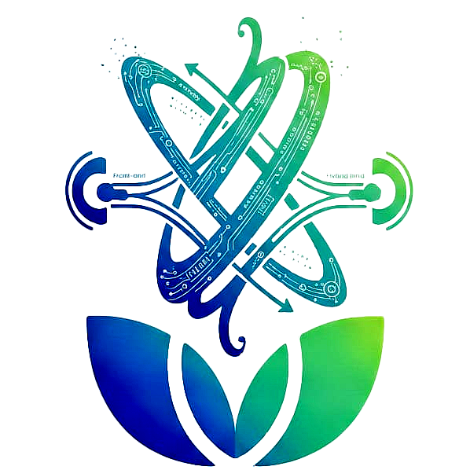
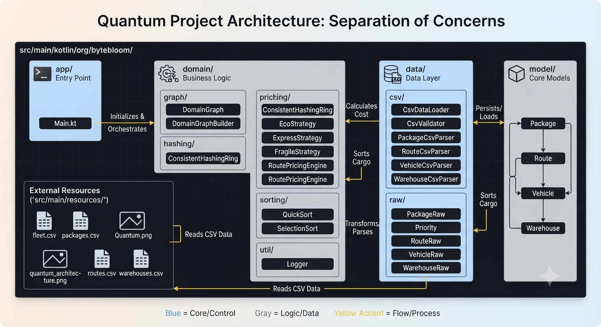

<div align="center" style="background: linear-gradient(135deg, #0d1117 0%, #161b22 100%); padding: 35px; border-radius: 16px; margin-bottom: 30px; border: 1px solid #30363d; box-shadow: 0 8px 24px rgba(0,0,0,0.6);">
  
  <h2 style="color: #c9d1d9; margin-top: 18px; font-family: -apple-system, BlinkMacSystemFont, 'Segoe UI', Roboto, sans-serif; letter-spacing: 1.5px; font-weight: 600;">QUANTOM TEAM</h2>
  <p style="color: #8b949e; font-size: 14px; margin: 4px 0 0 0;">Project Team Charter & Architecture</p>
</div>

## Team Roles & Responsibilities
*   **Workflow Lead (Abdallah Jarwan):** Repository governance, branching model maintenance, and commit message enforcement.
*   **Clean Standards Lead (Zain ALajjouri):** Sets coding style guidelines, ensures adherence to Kotlin clean code principles, and manages automated linting configurations.
*   **Communication & SLA Lead (Marah Issa):** Oversees team communication protocols, manages meeting cadences, and ensures adherence to Service Level Agreements (SLAs).
*   **Architecture & Environment Lead (Hadeel Hejazy):** Manages project directory structure, dependency management, and configuration of environment ignores.

---

## 1. Abdallah Jarwan – Workflow

### 1.1 Branching Model: Feature-Branch Workflow
We use a centralized Feature-Branch model to ensure stable releases:
* **`main` Branch:** Protected. Merging is allowed only via validated Pull Requests.
* **`feature/` Branches:** All development must occur in branches named `feature/[task-name]`.
* **PR Requirement:** Every change must be submitted via a Pull Request (PR) and requires **two (2) peer approvals** before merging into `main`.

### 1.2 Commit Message Standards
All commits must follow the **Conventional Commits** specification: `type(scope): description`.
* **Types:** `feat` (new feature), `fix` (bug correction), `docs`, `style`, `refactor`, `test`, `chore`.
* **Example:** `feat(workflow): establish team roles and branching model`.

---

## 2. Zain ALajjouri – Clean Standards

### 2.1 Naming Conventions (Kotlin Standards)
* **Variables:** `camelCase` (descriptive names, e.g., `userRegistrationDate`).
* **Functions:** `camelCase` (verb-based, e.g., `calculateTotalScore()`).
* **Classes:** `PascalCase` (e.g., `SmartSafeLock`).
* **Constants:** `UPPER_SNAKE_CASE` (e.g., `MAX_RETRY_ATTEMPTS`).
* **Booleans:** Prefix with `is`, `has`, or `should`.

### 2.2 Function & Code Quality
* **Single Responsibility (SRP):** Each function performs one action; otherwise, split it.
* **Limit Parameters:** Max 3 parameters; wrap extra data in a `data class` within `org.bytebloom.org.bytebloom.domain.model.app.app.models/`.
* **Clean Layout:** 4-space indentation, max 120 chars per line, and logical whitespace.
* **Comments:** Explain the "Why", not the "What".

---

## 3. Marah Issa – Communication & SLAs

### 3.1 Communication Protocols
* **Meeting Cadence:** Daily syncs are set for **11:00 AM**, unless a critical circumstance prevents it.
* **Core Hours:** Team members are expected to be available for collaboration between **1:00 PM – 5:00 PM**.
* **Channels:** GitHub (Docs/PRs), WhatsApp (Syncs/Urgent), Google Meet (Meetings).

### 3.2 Service Level Agreements (SLAs)
* **Urgent Messages:** Response within 2 hours.
* **General Inquiries:** Response within 24 hours.
* **Pull Request Review:** Review required within **24 hours**.
* **Feedback Integration:** Requested changes addressed within **48 hours**.

### 3.3 Peer Review Checklist 
Every review must verify:
1. Code Structure/Naming.
2. IEEE-compliant documentation for complex functions.
3. Compliance with functional requirements.
---
## 4. Hadeel Hejazy – Architecture & .gitignore

### 4.1 Project Architecture
We follow a professional modular architecture separating business org.bytebloom.org.bytebloom.presentation.app.logic, data org.bytebloom.org.bytebloom.presentation.app.models, and entry points.

**Standard Directory Structure:**
```text
Quantum_Project/
├── config/
├── gradle/
├── out/
└── src/
    └── main/
        ├── kotlin/
        │   └── org/
        │       └── bytebloom/
        │           ├── data/
        │           │
        │           ├── domain/
        │           │   ├── commandPattern/
        │           │   │   ├── AssignPackageToQueueCommand.kt
        │           │   │   ├── Command.kt
        │           │   │   ├── CommandIntegration.kt
        │           │   │   ├── CommandInvoker.kt
        │           │   │   └── DispatchVehicleCommand.kt
        │           │   │
        │           │   ├── model/
        │           │   │   ├── Package.kt
        │           │   │   ├── Priority.kt
        │           │   │   ├── Route.kt
        │           │   │   ├── ShipmentEstimate.kt
        │           │   │   ├── Vehicle.kt
        │           │   │   └── Warehouse.kt
        │           │   │
        │           │   ├── performance/
        │           │   │   ├── PackageTrackingIdGenerator.kt
        │           │   │   ├── TreePerformanceReport.kt
        │           │   │   └── TreeSearchResult.kt
        │           │   │
        │           │   ├── pricing/
        │           │   │   ├── core/
        │           │   │   │   ├── BasePackageComponent.kt
        │           │   │   │   ├── PackageComponent.kt
        │           │   │   │   ├── PricingEngine.kt
        │           │   │   │   └── RoutePricingEngine.kt
        │           │   │   ├── decorator/
        │           │   │   │   ├── ColdChainDecorator.kt
        │           │   │   │   ├── ExpressInsuranceDecorator.kt
        │           │   │   │   ├── FragileHandlingDecorator.kt
        │           │   │   │   └── PackageDecorator.kt
        │           │   │   └── strategy/
        │           │   │       ├── DispatchStrategy.kt
        │           │   │       ├── EcoStrategy.kt
        │           │   │       ├── ExpressStrategy.kt
        │           │   │       └── FragileStrategy.kt
        │           │   │
        │           │   ├── printing/
        │           │   │   └── Printing.kt
        │           │   │
        │           │   ├── repository/
        │           │   │   ├── PackageRepository.kt
        │           │   │   ├── RouteRepository.kt
        │           │   │   ├── VehicleRepository.kt
        │           │   │   └── WarehouseRepository.kt
        │           │   │
        │           │   ├── routing/
        │           │   │   ├── bfs/
        │           │   │   │   ├── BfsBenchmark.kt
        │           │   │   │   ├── BidirectionalBreadthFirstRouter.kt
        │           │   │   │   └── UnidirectionalBreadthFirstRouter.kt
        │           │   │   ├── common/
        │           │   │   │   ├── EmptyHubFinder.kt
        │           │   │   │   ├── RouteFinder.kt
        │           │   │   │   └── RouterValidator.kt
        │           │   │   ├── dijkstra/
        │           │   │   │   ├── DijkstraRouter.kt
        │           │   │   │   ├── BidirectionalBFSConnectivityChecker.kt
        │           │   │   │   ├── GraphEmptyHubFinder.kt
        │           │   │   │   ├── WarehouseGraph.kt
        │           │   │   │   └── WarehouseGraphBuilder.kt
        │           │   │   └── sorting/
        │           │   │       ├── QuickSort.kt
        │           │   │       └── SelectionSort.kt
        │           │   │
        │           │   ├── tree/
        │           │   │   ├── binary/
        │           │   │   │   ├── AVLTree.kt
        │           │   │   │   └── BST.kt
        │           │   │   └── hierarchicalHub/
        │           │   │       ├── HubTree.kt
        │           │   │       ├── HubTreeBuilder.kt
        │           │   │       ├── HubTreeNode.kt
        │           │   │       ├── HubType.kt
        │           │   │       ├── HubTypeResolver.kt
        │           │   │       └── Node.kt
        │           │   │
        │           │   └── usecase/
        │           │       ├── required/
        │           │       │   ├── AddVehicleToHubUseCase.kt
        │           │       │   ├── AssignPackageToCargoQueueUseCase.kt
        │           │       │   ├── CalculatePricingUseCase.kt
        │           │       │   ├── DispatchVehicleUseCase.kt
        │           │       │   ├── EstimateShipmentDeliveryUseCase.kt
        │           │       │   ├── FindAllPairsShortestPathUseCase.kt
        │           │       │   ├── FindBackhaulOpportunitiesUseCase.kt
        │           │       │   ├── FindBestVehicleByCostCapacityUseCase.kt
        │           │       │   ├── FindFewestHopsRouteUseCase.kt
        │           │       │   ├── FindNearestEmptyHubUseCase.kt
        │           │       │   ├── FindOptimalPathUseCase.kt
        │           │       │   ├── FindPackagesAboveWeightUseCase.kt
        │           │       │   ├── FindPackagesByPriorityUseCase.kt
        │           │       │   ├── FindStationedVehiclesByCapacityUseCase.kt
        │           │       │   ├── GetWarehouseLoadFactorUseCase.kt
        │           │       │   ├── GetWarehouseReportUseCase.kt
        │           │       │   ├── RecoverCargoAfterVehicleFailureUseCase.kt
        │           │       │   ├── ReroutePackageUseCase.kt
        │           │       │   ├── TraceHubLineageUseCase.kt
        │           │       │   ├── VerifyHubLinkUseCase.kt
        │           │       │   └── WarehouseReport.kt
        │           │       └── vehicleReshuffling/
        │           │           ├── ConsistentHashingRing.kt
        │           │           └── RingValidation.kt
        │           │
        │           ├── presentation/
        │           │   └── Main.kt
        │           │
        │           └── util/
        │               └── Logger.kt
        │
        └── resources/
            ├── fleet.csv
            ├── packages.csv
            ├── Quantom.png
            ├── quantom_architecture.png
            ├── routes.csv
            └── warehouses.csv
```
<div align="center" style="background: linear-gradient(135deg, #0d1117 0%, #161b22 100%); padding: 25px; border-radius: 14px; margin: 25px 0; border: 1px solid #30363d; box-shadow: 0 8px 24px rgba(0,0,0,0.5);">
  
  <p style="color: #8b949e; font-size: 13px; margin-top: 12px; font-style: italic;">Figure 4.1: High-Level System Architecture & Component Interactions</p>
</div>
**This charter is more than just a regulatory document; it is a professional commitment and a moral agreement among the members of Team Quantom. We believe that engineering excellence begins with discipline and precision. Therefore, we pledge to uphold these standards to ensure the delivery of our graduation project with the highest levels of quality and professionalism.**
